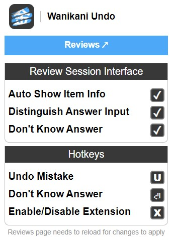

# WaniKani Undo

### Unofficial Browser Extension

This is an unofficial extension for the browser to undo wrong answers when doing reviews at [WaniKani.com](https://www.wanikani.com/).

## Table of contents:
1. [Latest Features](#changelog-v020)
2. [Usage Guide](#usage-guide)
	* 2.1 [Undo Answer](#undo-answer)
	* 2.2 [Skip Answer](#skip-answer)
	* 2.3 [Disable Extension](#disable-extension)
	* 2.4 [Shortcut Keys](#shortcut-keys)
	* 2.5 [Settings](#settings)
3. [Pictures](#pictures)

## Changelog v0.2.0

### Content
- Fixed issue when some answers are wrong but given a retry by Wanikani, the answer input did not go back to normal, but instead stayed red
- Added possibility to skip answers that the user doesn't know at all. The Skipping is done either through the **Don't Know (?)** button next to the Undo button, or by clicking **Enter** when the text input is empty
- Changed shortcut keys:
	- **Enter:** Skip answer when you don't know it (only if the answer input is empty)
	- **Space:** Put cursor back into answer input

### Popup
- Added checkbox to enable the answer skipping feature
- Added button that links to Reviews page on Wanikani

#### [(All changelogs)](CHANGELOG.md)

## Usage Guide
### Undo Answer:
When doing a session of reviews in Wanikani, if you get an answer wrong, either meaning or reading, you have the possibility to, right away, go back with your answer, before it is actually submited, and rectify it.

To undo an answer you can either click the button with the undo symbol, or use a shortcut key (default is 'U').

You can only undo an answer the first time you send it. In this stage of just one send click, if the answer is wrong, it is not yet submited to WaniKani servers. If you send it again, without undoing it, then it will behave as a normal wrong answer.

Answer information will only be available to you after you confirm that you want to send it, either correct of incorrect. (If you can still undo an answer, then you won't have access to the subject information)

The point of this system is to prevent "damaging" the SRS in case you make a silly typo that is not covered by WaniKani's answer checking system.

This system can, obviously, be exploited in ways that will harm your learning. If you use it to rectify an answer you weren't sure, then you will complete that subject successfully and advance an SRS stage, even though you weren't fully ready for it.

Correct answers cannot be undone.

### Skip Answer
While doing reviews, if you don't know an answer to either a reading or a meaning, you can skip it, by either clicking the **Don't Know (?)** button next to the Undo button, or by clicking **Enter** when the text input is empty. This will mark the answer as wrong, but you won't need to write anything.

This feature has a 1.5s delay for every subject to avoid missclicks while hiting Enter to get a new subject.

### Disable Extension:
You can disable this extension in real time, meaning, if you decide you don't want to be able to undo your answers, even if in the middle of a review session, you either click the extension icon, within the page, in the top right corner, or use a shortcut key (default is 'X')

The same thing goes for enabling it.

### Shortcut Keys:
There a few shortcut keys that allow you to interact with some features through your keyboard. The default shortcuts are:
- **U**: Undo a wrong answer   
- **X**: Disable/enable extension in real time
- **Esc**: Remove cursor from answer input and stop typing
- **Enter (⏎)**: Skip answer when you don't know it (only if the answer input is empty)
- **Space (⎵)**: Put cursor back into answer input

### Settings:
The extension popup has a few settings that can be managed.
- **Review Session Interface**
	- **Auto Show Item Info:** open item info immediatly after an answer is confirmed as correct or incorrect
	- **Distinguish Answer Input:** add a decorative line to the left side of the answer input to indicate that the extension is active
	- **Skip Answer**: enable feature to skip answer if you don't know it
- **Hotkeys**
	- (Change any shortcut key you want)

## Pictures

